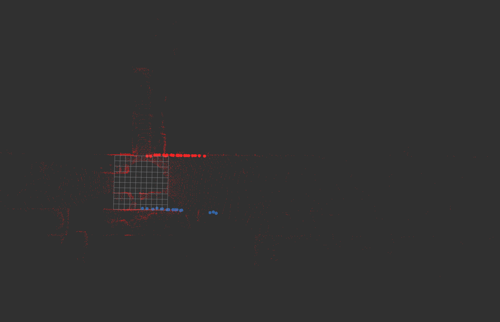

# 3D Lidar Curb Dectection in ROS

> SOURCE https://github.com/wangguojun2018/LidarRoadBoundaryDetection

This package is a **ROS** implementation for the code of the article above. Some bugs about boundary conditions have been fixed.

This package can be used for **Road Curb Dectection** based on 3D LiDAR.


## Example


## Dependencies

- glog
- pcl 1.8
- Opencv 3.4
- boost
- [limbo](http://www.resibots.eu/limbo/tutorials/compilation.html)

## Run
```bash
roslaunch lidar_curb_detection lidar_curb_detection.launch
```