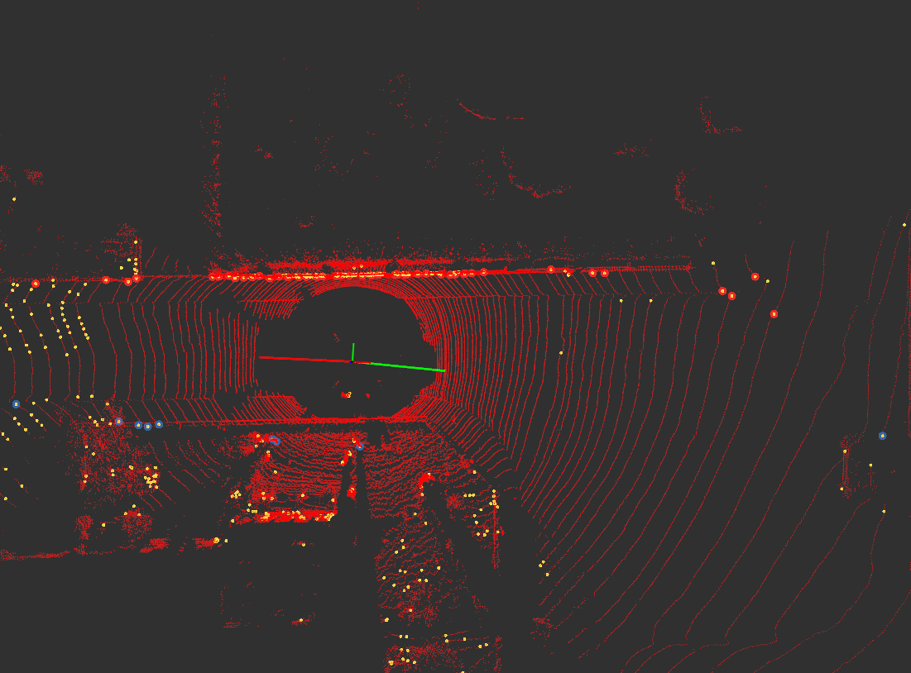

# 3D Lidar Curb Dectection in ROS

> SOURCE https://github.com/wangguojun2018/LidarRoadBoundaryDetection

This package is a **ROS** implementation for the code of the article above. Some bugs about boundary conditions have been fixed.

This package can be used for **Road Curb Dectection** based on 3D LiDAR.

Lidar Curb Detection can detect the direction of the curb along the roads, which can have a certain effect on dividing the passable area. For example, like this:


## Rviz Example

In the picture here, the green and red pillars are the left and right divisions of the front and rear roads, respectively. Yellow dots are rough roadside points, red and blue are the roadside points that are carefully selected from the yellow dots, that is, the final result.


## Dependencies

- [glog](https://github.com/google/glog)
- pcl 1.8
- Opencv 3.4
- boost : `sudo apt install libboost-all-dev`
- [limbo](http://www.resibots.eu/limbo/tutorials/compilation.html)(**It has been built in the third -party library folder, no need to install it again**)

## Params
You can change your params in [params.yaml](https://github.com/speedzjy/lidar_curb_detection/blob/main/config/params.yaml).

## Run
```bash
roslaunch lidar_curb_detection lidar_curb_detection.launch
```